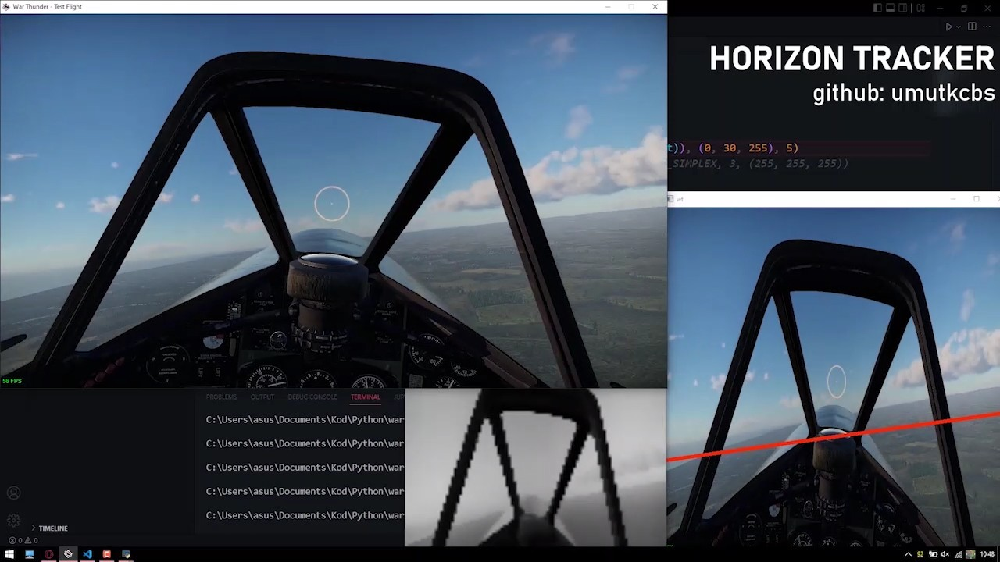

# horizon-tracker

This can be used to get pitch and roll degrees of aircraft and help autonomous flight without using additional sensors.  
-----o-----  
All the code running on Python and detecting with image processing. I tried detect 2 values at the same time with CNN model but I couldn't make it bc of limited dataset. I wrote scripts to get plane orientation from game engine. However engine giving this values around 0.75 second delay so it's impossible to collect reliable dataset. 
-----o-----   
This method just looking blue values in image and finds edge of horizon. There is a "threshold" variable for increase accuracy in different scenarios (like sunset, sunrise, cloudy or foggy weathers). You can click image to watch demonstration video. (Game is War Thunder)

